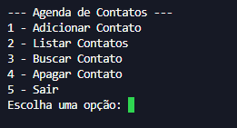
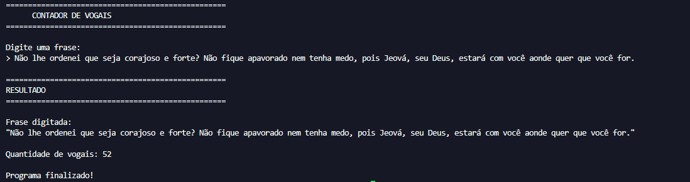
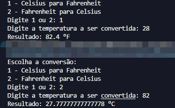
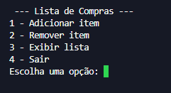

# 🐍 Exercícios Intermediários em Python

Repositório criado para praticar conceitos intermediários da linguagem Python, reforçando lógica de programação, manipulação de dados, funções e estruturas mais organizadas durante os estudos de Análise e Desenvolvimento de Sistemas.

---

## 📚 Conteúdo do repositório

Os exercícios deste repositório possuem foco em desenvolver maior organização de código, reutilização de funções e resolução de problemas mais completos.

### Exercícios disponíveis

* 📒 Agenda de Contatos
* 🔤 Contador de Vogais
* 🌡️ Conversor de Temperatura
* ➗ Fatorial de Número
* 🛒 Lista de Compras

---

## 🚀 Tecnologias utilizadas

* Python 3

---

## 🎯 Objetivo

Este repositório faz parte da construção do meu portfólio no GitHub e da evolução dos meus conhecimentos em Python.

Os exercícios têm como objetivo praticar:

* Funções
* Listas
* Dicionários
* Estruturas condicionais
* Laços de repetição
* Organização de código
* Manipulação de texto
* Lógica matemática
* Menus interativos no terminal

---

## 📸 Screenshots

### 📒 Agenda de Contatos



---

### 🔤 Contador de Vogais



---

### 🌡️ Conversor de Temperatura



---

### ➗ Fatorial de Número


---

### 🛒 Lista de Compras



---

## ▶️ Como executar os exercícios

1. Clone este repositório
2. Abra a pasta do projeto
3. Execute o arquivo desejado

Exemplo:

```bash
agenda.py
```

---

## 📁 Estrutura do projeto

```text
python-exercicios-intermediarios/
│
├── README.md
├── agenda.py
├── contador_vogais.py
├── conversor_temperatura.py
├── fatorial.py
├── lista_compras.py
│
└── assets/
    ├── agenda.png
    ├── contador_vogais.png
    ├── conversor_temperatura.png
    ├── fatorial.png
    └── lista_compras.png
```

---

## 📌 Observações

Novos exercícios serão adicionados conforme a evolução dos estudos e aprendizado em Python.

---

## 👨‍💻 Autor

Lucas Santos
Estudante de Análise e Desenvolvimento de Sistemas.
